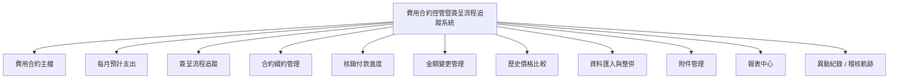
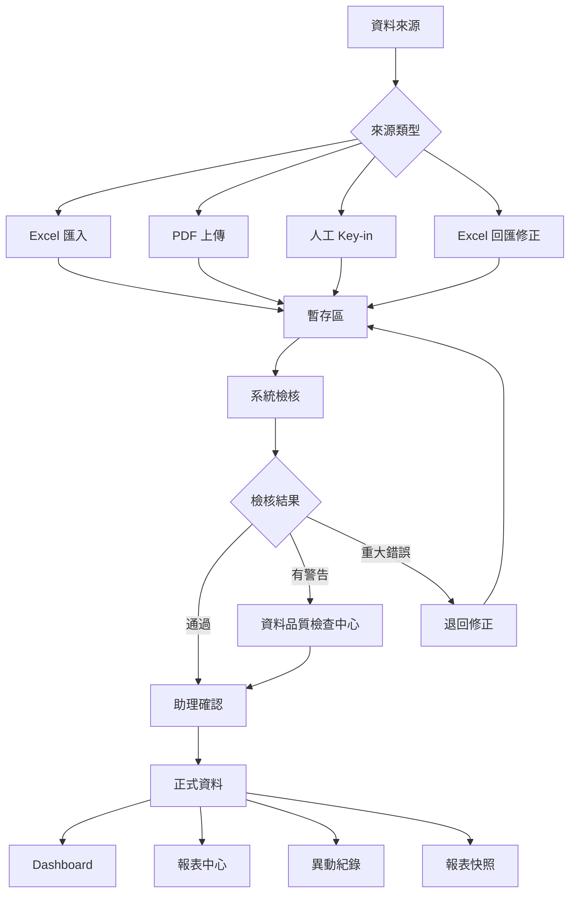
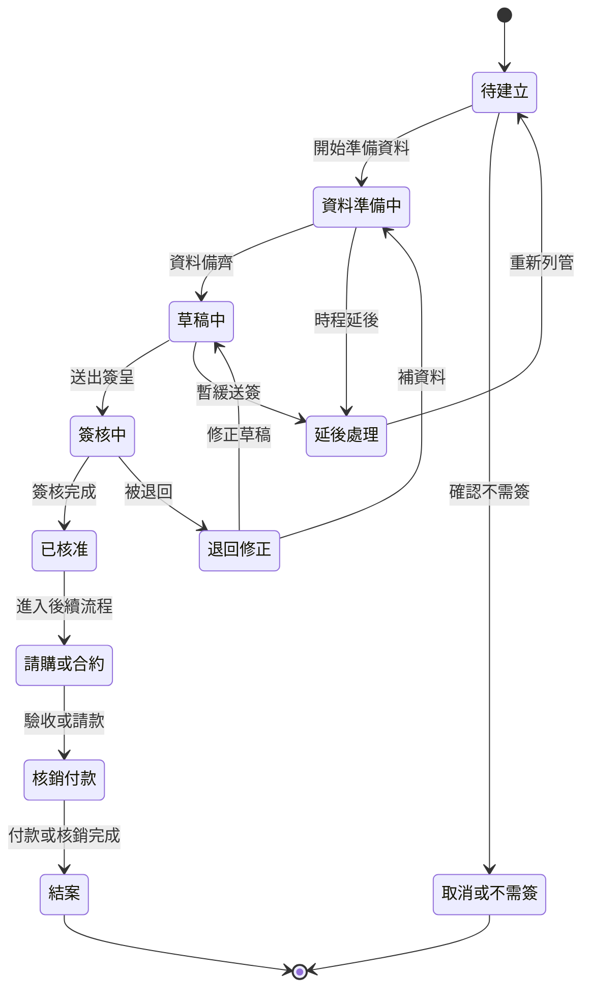
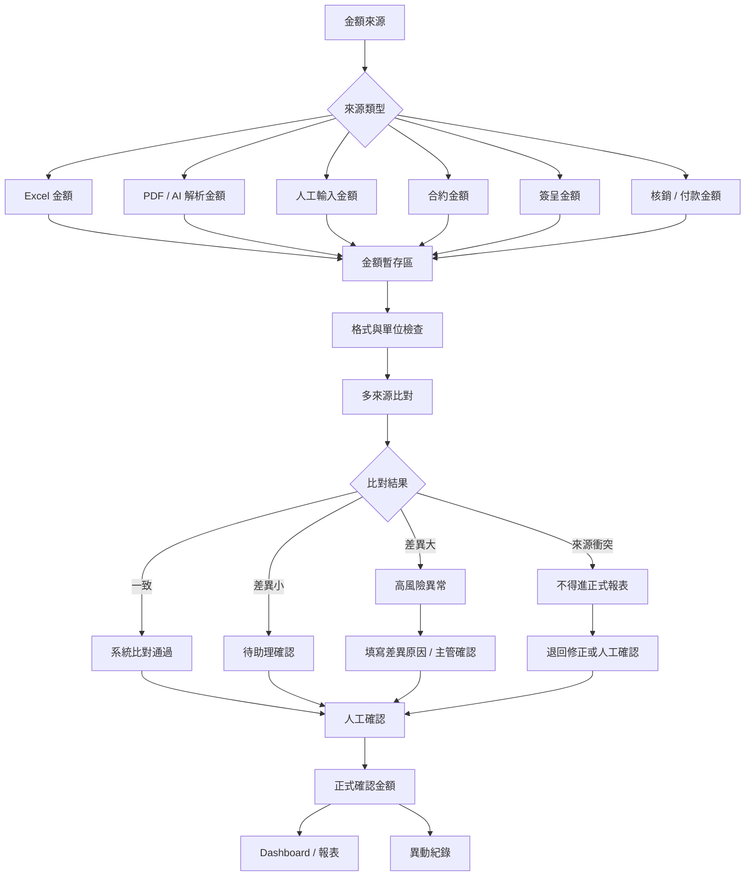
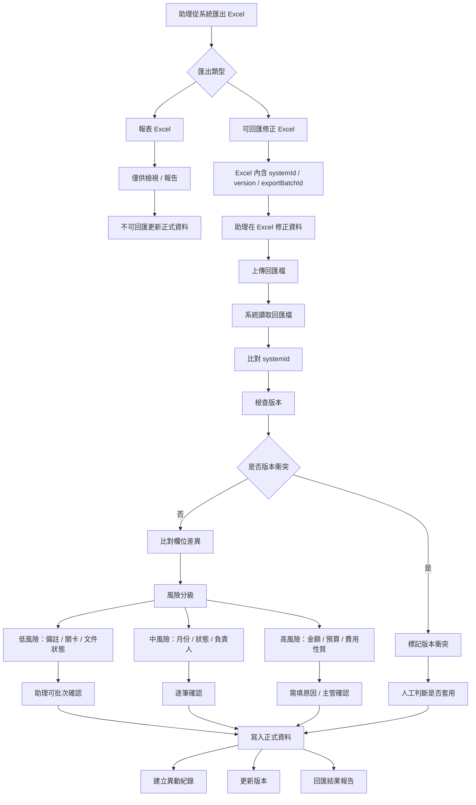
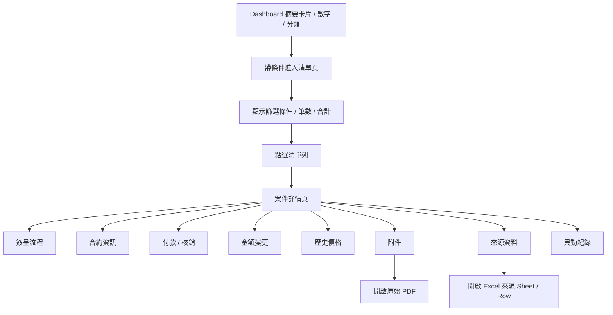
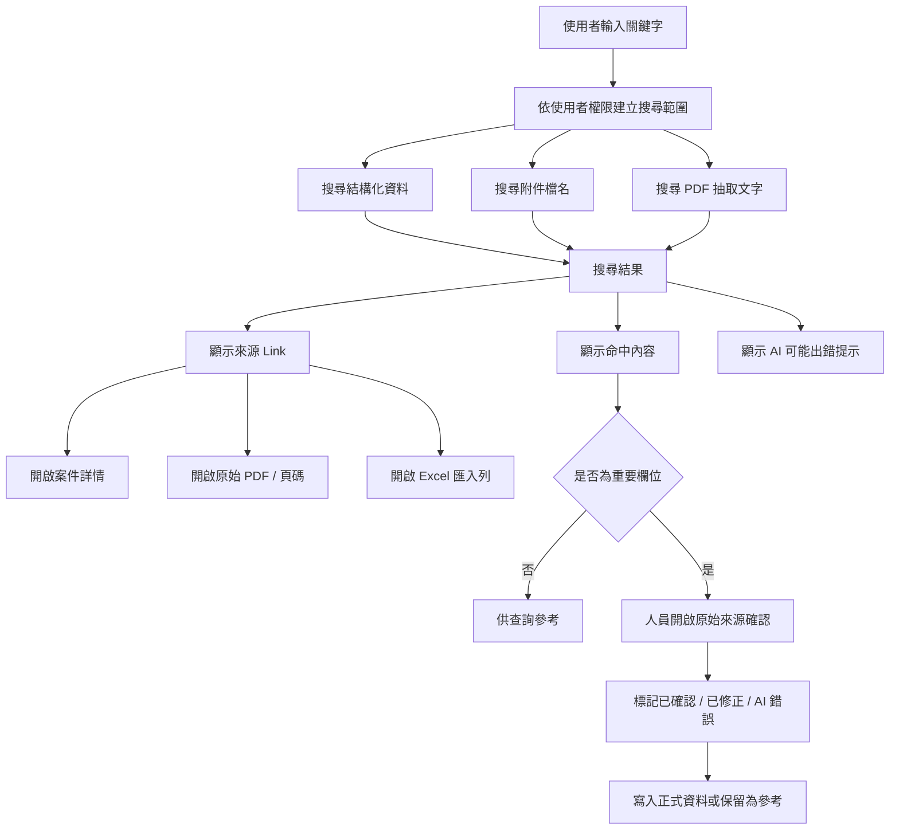

# 費用合約控管暨簽呈流程追蹤系統 - Codex 開發交接規格 v1.9 完整合併版

版本：v1.9  
日期：2026-06-08 05:34  
用途：交給 Codex / 開發者作為第一版系統開發依據  
本版修正：v1.8 曾誤產為「增量摘要版」，導致檔案由 v1.1 的完整規格縮小。v1.9 修正為「完整合併版」：完整保留 v1.1 全文，並追加 v1.8 最新 UI / 權限 / SKILL 規則。

---

## v1.9 修正說明

1. 完整保留 v1.1 的原始開發規格、資料模型、API、Sprint、驗收標準與設計原則。
2. 追加 v1.8 新增規則：功能只增不減、四角色完整子功能、處長不主打 PM 線性圖、主管新增已完成與差異比較、管理者 / 助理案件新增編輯作廢與動作紀錄、主狀態統計平衡、表格皆可排序、不可顯示內部討論文字。
3. 本檔是交給 Codex 的完整規格，不是摘要版。

---

## A. v1.1 完整規格全文（保留）

# 費用合約控管暨簽呈流程追蹤系統 - Codex 開發交接規格

版本：v1.1  
用途：交給 Codex / 開發者作為第一版系統開發依據  
語言：繁體中文  
系統定位：費用合約控管、月度支出預測、簽呈流程追蹤、續約管理、金額驗證、全文搜尋、來源連結與報表快照
更新重點：整合今日討論，新增「全下鑽式 Dashboard」、「全文搜尋含 PDF 內容」、「來源 Link」、「AI 輔助與人工確認提示」

---

## 0. 開發最高優先規範

本專案開發必須遵守使用者提供的 `StructeredPrompt` 開發規範。

### 0.1 後端技術限制

1. 禁止使用 PHP。
2. 不得產生任何 `.php` 檔案。
3. Node.js 預設使用 CommonJS。
4. 不預設使用 ESM。
5. Node.js 入口必須為：

```text
src/server.cjs
```

6. 必須提供 `/health` endpoint。
7. 必須提供 `package.json` scripts：

```json
{
  "scripts": {
    "dev": "node src/server.cjs",
    "start": "node src/server.cjs",
    "check": "node --check src/server.cjs",
    "doctor": "node src/server.cjs --doctor"
  }
}
```

8. `src/server.cjs` 必須直接呼叫 `main()`。
9. `main()` 必須呼叫 `startServer()`。
10. `startServer()` 必須明確呼叫：

```js
server.listen(PORT, '0.0.0.0')
```

11. 啟動後不得立即結束。
12. 必須有清楚啟動 log：

```text
[BOOT-ENTRY] src/server.cjs loaded
[BOOT] Starting server
[BOOT] calling server.listen()
Server started: http://localhost:3001
Health check: http://localhost:3001/health
```

### 0.2 資料儲存原則

第一版若為內部原型，可先使用 `data/db.json`，但必須保留 service 分層，未來可改為 SQL Server。

正式環境建議使用 Microsoft SQL Server。

所有資料寫入必須經過後端 service，不得讓前端直接讀寫 `data/db.json`。

### 0.3 API 文件

必須提供 Swagger 文件。

零依賴 Node.js 版本至少提供：

```text
public/swagger.yaml
public/swagger.json
public/swagger/index.html
```

公開 API 不得未記錄於 Swagger。

### 0.4 前端結構

前端使用 vanilla HTML / CSS / JavaScript 即可。不要一開始導入大型框架。

必須拆檔：

```text
public/index.html
public/css/styles.css
public/js/api.js
public/js/state.js
public/js/render.js
public/js/handlers.js
public/js/utils.js
```

不得在 HTML 中寫大量 inline JavaScript 或 inline CSS。

---

## 1. 系統目標

本系統不是單純將 Excel 搬到網頁，而是建立一套可控、可查、可相信、可交接的費用合約控管平台。

系統需要回答以下問題：

| 問題 | 系統能力 |
|---|---|
| 每個月要支出多少？ | 月度支出預測 |
| 哪些是例行性費用？ | 費用性質分類 |
| 哪些是非計畫性費用？ | 非計畫性項目管理 |
| 原本 1000W 為何變 1500W？ | 金額變更追蹤 |
| 哪些合約要續約？ | 合約續約管理 |
| 哪些簽呈應該上但還沒上？ | 每月應上簽清單 |
| 哪個簽呈現在進度在哪？ | 簽呈流程追蹤 |
| 金額是否正確？ | 金額驗證中心 |
| Excel 資料如何轉入系統？ | 匯入 / 回匯控管 |
| 報表事後能否對得起來？ | 報表快照與異動紀錄 |
| 每個摘要數字能否點進去查明細？ | 全下鑽式 Dashboard：摘要 → 清單 → 案件詳情 → 原始來源 |
| 能否搜尋附件 PDF 內容？ | 全文搜尋與 PDF 文字索引 |
| 找到資料後能否看原始檔？ | 每筆結果提供來源 Link、頁碼 / Sheet / Row |
| AI 結果是否可靠？ | AI 僅輔助，重要欄位需人工確認，畫面固定提示 AI 可能出錯 |


---

## 2. 第一版 MVP 範圍

### 2.1 第一版必做

| 模組 | 說明 |
|---|---|
| 助理資料管理工作台 | 助理是系統主要使用者，負責匯入、整併、檢核、報表 |
| Excel 初始匯入 | 以 `費用合約整合(舊)` 為主資料來源 |
| Excel 回匯修正 | 助理匯出可回匯 Excel，修正後回匯，系統比對差異 |
| 費用合約主檔 | 系統核心主資料 |
| 月度支出預測 | 處長要看每月支出 |
| 簽呈流程追蹤 | 主管要看每個簽呈目前在哪裡 |
| 合約續約管理 | 續約件數、金額、進度、到期提醒 |
| 核銷付款進度 | 預計付款、實際核銷、核銷狀態 |
| 金額變更管理 | 原金額、新金額、差異、原因 |
| 歷史價格比較 | 去年同月、去年同期、本案上次價格 |
| 金額驗證中心 | 防止金額錯誤、AI / PDF 解析錯誤 |
| 附件管理 | PDF 上傳與綁定，第一版不直接相信 AI 解析 |
| 報表中心 | 處長月報、主管追蹤表、每月支出表 |
| 報表快照 | 報表產出後保存當時版本 |
| 異動紀錄 | 所有重要修改留下原值、新值、修改人、時間 |
| 全下鑽式 Dashboard | 所有卡片、數字、分類、清單列皆可點入明細 |
| 全文搜尋 | 搜尋主檔、簽呈、合約、核銷、異動紀錄與附件內容 |
| PDF 內容搜尋 | 文字型 PDF 抽取文字並建立搜尋索引，結果提供原始 PDF Link |
| 來源 Link / 證據鏈 | 搜尋結果與 AI 建議需可連回案件、PDF、Excel 來源位置 |
| AI 輔助提示 | 畫面顯示 AI 可能會出錯，需人員開啟原始檔確認 |


### 2.2 第一版先不做或不完整做

| 功能 | 第一版處理方式 |
|---|---|
| PDF AI 自動解析正式金額 | 不直接入正式資料，只可作為待確認建議值 |
| 完整 BPM 簽核引擎 | 不取代正式簽核系統，只做流程追蹤台帳 |
| 會計系統串接 | 第二階段 |
| 採購 / 驗收系統串接 | 第二階段 |
| 完整 PDF OCR 自動建案 | 第二階段 |
| 歷史附件完整補齊 | 第二階段 |
| 掃描型 PDF OCR | 第二階段；第一版可標示尚未可全文搜尋 |
| AI 自動認定正式資料 | 不做；AI 僅作候選與輔助摘要 |
| AI 語意問答搜尋 | 第三階段，可在全文搜尋穩定後再做 |


---

## 3. 資料來源定位

### 3.1 Excel 來源定位

| 檔案 | 定位 | 第一版處理方式 |
|---|---|---|
| `費用合約整合(舊).xlsx` | 主資料來源 | 第一版以此建立費用合約主檔 |
| `費用項目整合23.xlsx` | 新版整理中資料 / 補充來源 | 先進暫存與整併，不直接覆蓋主檔 |
| `2026次月預計上簽項目.xlsx` | 每月應上簽資料 | 匯入為 `signing_cases` 或 `signing_plans` |
| `架構部續約合約進度.xlsx` | 合約續約進度 | 匯入合約續約管理 |
| `資訊架構部處級專案進度追蹤總表.xlsx` | 專案進度參考 | 第一版可先保留 project 關聯，不必完整導入 |
| `金控專案_20260323.xlsx` | 跨子公司 / 金控專案資料 | 視需求匯入主檔或專案標籤 |

### 3.2 資料來源規則

第一次：

```text
Excel 匯入建立基礎資料
```

日後：

```text
PDF 上傳 + 人工 Key-in + 必要時 Excel 批次匯入 / 回匯修正
```

所有資料來源都必須：

```text
來源資料 → 暫存區 → 檢核 → 助理確認 → 正式資料 → 報表 / Dashboard
```

---

## 4. 使用角色與畫面重點

### 4.1 角色定義

| 角色 | 定位 | 畫面重點 |
|---|---|---|
| 處長 | 決策摘要與月度支出 | 每月支出、例行性、非計畫性、變更、續約摘要 |
| 主管 | 流程與風險追蹤 | 每月應上簽、簽呈進度、卡關、逾期 |
| 助理 | 系統資料管理者 | 匯入、整併、檢核、金額驗證、報表、回匯 |
| 承辦 | 案件執行者 | 自己案件、簽呈進度、文件、核銷狀態 |

### 4.2 權限原則

| 動作 | 處長 | 主管 | 助理 | 承辦 |
|---|---|---|---|---|
| 看摘要 | 可 | 可 | 可 | 限自己 |
| 看明細 | 可下鑽 | 可 | 可 | 限自己 |
| 匯入 Excel | 不可 | 不可 | 可 | 不可 |
| 編輯主檔 | 不可 | 審閱 | 可 | 限自己案件部分欄位 |
| 更新簽呈進度 | 不可 | 可註記 | 可 | 可 |
| 修改金額 | 不可 | 需確認 | 可提送 / 修正 | 不建議 |
| 確認金額變更 | 可決策 | 可確認 | 可送審 | 提供原因 |
| 匯出報表 | 可 | 可 | 可 | 視權限 |
| 刪除資料 | 不建議 | 不可 | 不建議，改作廢 | 不可 |

---

## 5. 畫面設計

### 5.1 處長首頁

目標：資訊不要多，但能掌握每月支出與重大異常。

區塊：

1. 年度總覽
2. 本月 / 次月預計支出
3. 每月支出趨勢
4. 例行性 / 非計畫性 / 變更項目摘要
5. 續約件數與金額
6. 重大異常 / 待決策事項
7. 下鑽看細項

示例卡片：

| 指標 | 顯示 |
|---|---:|
| 年度列管總金額 | 1.8 億 |
| 本月預計支出 | 1,700 萬 |
| 次月預計支出 | 1,200 萬 |
| 變更增加金額 | +1,500 萬 |
| 本年度續約件數 | 9 件 |

### 5.2 主管首頁

目標：看每月應上簽、簽呈目前在哪裡、是否卡關。

區塊：

1. 本月應上簽
2. 下月應上簽
3. 簽呈狀態分布
4. 卡關案件
5. 逾期案件
6. 合約續約進度
7. 核銷異常

### 5.3 助理資料管理工作台

助理是最主要使用者，必須有獨立介面。

區塊：

1. 資料更新月曆
2. Excel 匯入中心
3. 匯入批次管理
4. 資料整併中心
5. 資料品質檢查
6. 金額驗證中心
7. 報表產出中心
8. Excel 回匯修正中心

### 5.4 承辦首頁

區塊：

1. 我的待建立簽呈
2. 我的簽核中案件
3. 我的待補文件
4. 我的核銷待處理
5. 我的合約即將到期
6. 我的逾期案件

---


### 5.5 全下鑽式 Dashboard 原則

本系統所有摘要資訊皆需可點擊下鑽，不能只顯示靜態數字。

統一下鑽層級：

```text
L1 Dashboard 摘要：件數、金額、分類、異常
L2 清單頁：符合條件的案件清單
L3 案件詳情頁：單一案件完整資訊
L4 原始來源：PDF、Excel 來源列、附件、異動紀錄
```

範例：

```text
處長首頁：本月預計支出 1,700 萬
→ 點入 2026-06 月度支出清單
→ 點入 A 系統續約
→ 查看案件詳情
→ 查看簽呈 PDF / 合約 PDF / Excel 來源 / 異動紀錄
```

### 5.6 可點擊項目規則

| 畫面項目 | 點擊後 |
|---|---|
| 本年度列管金額 | 年度費用總清單 |
| 本月預計支出 | 本月支出案件清單 |
| 次月預計支出 | 次月支出案件清單 |
| 例行性費用 | 例行性費用清單 |
| 非計畫性費用 | 非計畫性項目清單 |
| 變更增加金額 | 金額變更清單 |
| 續約件數與金額 | 續約案件清單 |
| 本月應上簽 | 本月應上簽清單 |
| 尚未建立 | 狀態為待建立的簽呈清單 |
| 簽核中 | 簽核中案件清單 |
| 逾期案件 | 逾期案件清單 |
| 金額衝突 | 金額驗證中心，帶入衝突條件 |
| 匯入待確認 | 匯入批次明細 |
| PDF 搜尋結果 | PDF 預覽頁，帶頁碼或命中段落 |
| Excel 來源 | 匯入批次、Sheet、Row 位置 |

### 5.7 下鑽頁共通要求

每個下鑽頁需顯示：

1. 麵包屑，例如：`處長首頁 > 本月預計支出 > 2026-06 支出清單 > A 系統續約`。
2. 目前篩選條件，例如月份、費用性質、狀態、金額狀態。
3. 筆數與合計金額。
4. 返回上一層按鈕。
5. 清單列可點入案件詳情。
6. 案件詳情可查看來源資料、附件、異動紀錄。

### 5.8 案件詳情頁分頁

所有清單最後應下鑽到同一個案件詳情頁，分頁如下：

```text
基本資料
簽呈流程
合約資訊
付款 / 核銷
金額變更
歷史價格
附件
全文搜尋命中
AI 建議與人工確認
異動紀錄
來源資料
```

### 5.9 全文搜尋中心

系統需提供全文搜尋功能，搜尋範圍包含結構化資料與附件內容。

搜尋範圍：

| 類型 | 搜尋內容 |
|---|---|
| 費用合約主檔 | 案名、廠商、費用項目代碼、分類、備註 |
| 簽呈案件 | 簽呈編號、主旨、狀態、目前關卡、卡關原因 |
| 合約資料 | 合約編號、合約名稱、廠商、合約狀態 |
| 核銷付款 | 請購編號、驗收編號、核銷編號、備註 |
| 金額變更 | 變更原因、差異說明 |
| 歷史價格 | 歷史案名、年度、廠商 |
| 異動紀錄 | 修改原因、備註、操作人 |
| 附件 | PDF / 文件檔名與可抽取文字內容 |

### 5.10 搜尋結果呈現

搜尋結果需分層顯示，不得只列檔名。

每筆結果需包含：

| 欄位 | 說明 |
|---|---|
| 類型 | 案件 / 簽呈 / 合約 / 核銷 / PDF / Excel / 異動紀錄 |
| 標題 | 案名、文件名或資料標題 |
| 命中內容 | 關鍵字附近文字或摘要 |
| 所屬案件 | 可點入案件詳情 |
| 來源檔案 | PDF、Excel 或系統資料 |
| 來源位置 | PDF 頁碼、Excel Sheet + Row、系統欄位 |
| 來源 Link | 可開啟原始檔案或來源位置 |
| 確認狀態 | 待確認 / 已確認 / 已修正 / AI 錯誤 |

### 5.11 PDF 內容搜尋

PDF 上傳後需保留原始檔，並嘗試抽取文字建立索引。

第一版處理原則：

| PDF 類型 | 第一版處理 |
|---|---|
| 文字型 PDF | 抽取文字、建立搜尋索引、可搜尋內容 |
| 掃描型 PDF | 可上傳，標示尚未可全文搜尋 |
| 掃描型 PDF + OCR | 第二階段支援 |

PDF 搜尋結果需提供：

```text
[查看案件] [開啟原始 PDF] [查看來源位置] [標記已確認]
```

PDF Link 建議格式：

```text
/documents/{documentId}/preview?page={pageNo}
```

Excel 來源 Link 建議格式：

```text
/import-batches/{importBatchId}/rows/{rowId}
```

### 5.12 AI 輔助與來源確認原則

AI / OCR / 全文搜尋可協助查找資料、摘要附件內容、擷取候選欄位，但 AI 結果不得直接作為正式資料。

基本原則：

1. AI 僅作為輔助，不作為最終依據。
2. 所有 AI 結果必須提供來源連結。
3. 來源連結需能開啟原始檔案或來源資料位置。
4. 對於 PDF，應盡量提供頁碼或命中段落。
5. 對於 Excel，應提供來源檔名、Sheet 名稱與 Row 編號。
6. 對於系統資料，應提供案件詳情頁連結。
7. 金額、月份、簽呈狀態、合約期間、付款條件等重要欄位必須由人員確認。
8. 未確認的 AI 結果不得進入正式報表。
9. 所有人工確認需記錄確認人、確認時間與確認值。
10. 使用者介面需明確提示 AI 可能會出錯。

畫面固定提示文字：

```text
AI 輔助提示：以下內容由系統根據資料與附件內容輔助整理，可能有誤。
請點選來源連結查看原始檔案，並由負責人員確認後再作為正式依據。
```

### 5.13 AI 建議區與正式資料區分離

案件詳情與金額驗證畫面需清楚分開：

```text
AI 建議區：AI / OCR / 搜尋命中的候選值，狀態為待確認。
正式資料區：經人員確認後的正式值，可進報表。
```

範例：

| 欄位 | AI 建議 | 來源 | 狀態 |
|---|---|---|---|
| 金額 | 1,500 萬 | A 系統簽呈.pdf 第 2 頁 | 待確認 |
| 合約期間 | 2026/01-2026/12 | 合約.pdf 第 3 頁 | 待確認 |

| 欄位 | 正式值 | 確認來源 | 確認人 |
|---|---|---|---|
| 金額 | 1,500 萬 | 人工確認 | 助理 |
| 合約期間 | 2026/01-2026/12 | 人工確認 | 承辦 |


## 6. 核心資料模型

### 6.1 通用欄位

所有正式資料表建議包含：

```text
id
createdAt
updatedAt
createdBy
updatedBy
version
isDeleted / status
```

正式環境若使用 SQL Server，應增加：

```text
rowVersion
```

用於避免 Excel 回匯覆蓋新資料。

---

### 6.2 cost_contract_items 費用合約主檔

系統核心主表。

```text
id                         系統主鍵
itemCode                   費用項目代碼，可空白
itemName                   案名 / 費用名稱
vendorName                 廠商
vendorTaxId                統編
expenseNature              例行性 / 非計畫性 / 計畫性
itemType                   續約 / 新購 / 汰換 / 加購 / 請款
budgetStatus               預算內 / 預算外 / 待確認
currentAmount              目前確認金額
amountStatus               待確認 / 已確認 / 來源衝突
ownerUserId                負責人
handlerUserId              承辦人
dataStatus                 暫存 / 待確認 / 正式 / 作廢
sourceFile                 來源檔案
sourceSheet                來源 Sheet
sourceRowNo                來源列號
lastSourceUpdatedMonth     來源資料更新到哪個月份
version                    資料版本
```

---

### 6.3 budget_items 預算資料

```text
id
costContractItemId
budgetYear
budgetType                 費用 / 資本
budgetAmount
budgetStatus
budgetCategory
ownerUserId
sourceFile
```

---

### 6.4 contracts 合約資料

```text
id
costContractItemId
contractNo
contractName
contractStartDate
contractEndDate
contractAmount
contractStatus
renewalStatus
isCrossYear
sourceFile
```

---

### 6.5 signing_cases 簽呈流程追蹤

```text
id
costContractItemId
signingNo                  簽呈編號，可空白
expectedSigningMonth       應上簽月份
signingType                預算 / 費用 / 請款 / 續約 / 補簽
signingAmount
status                     待建立 / 資料準備中 / 草稿中 / 簽核中 / 已核准 / 退回修正 / 延後 / 取消
currentStep                目前關卡
plannedSubmitDate
actualSubmitDate
plannedCompleteDate
actualCompleteDate
delayReason
ownerUserId
handlerUserId
```

---

### 6.6 signing_case_logs 簽呈流程歷程

```text
id
signingCaseId
changedAt
changedBy
fromStatus
toStatus
fromStep
toStep
comment
source                     Excel / 人工 / PDF / 系統
```

---

### 6.7 payment_schedules 付款期別

```text
id
costContractItemId
periodName                 第一期 / 第二期 / 繳別
plannedPaymentMonth
plannedAmount
paymentStatus              未開始 / 待請購 / 待驗收 / 待核銷 / 已完成
```

---

### 6.8 reimbursements 核銷資料

```text
id
costContractItemId
paymentScheduleId
reimbursementMonth
reimbursementAmount
reimbursementNo
purchaseNo
acceptanceNo
status                     待處理 / 待文件 / 已送會計 / 已完成
```

---

### 6.9 amount_changes 金額變更

```text
id
costContractItemId
originalAmount
newAmount
amountDelta
amountDeltaRate
changeType                 金額變更 / 範圍變更 / 期程變更 / 廠商變更
changeReason
confirmStatus              待確認 / 已確認 / 需主管確認 / 需處長決策
confirmedBy
confirmedAt
```

---

### 6.10 price_histories 歷史價格

```text
id
costContractItemId
year
periodStart
periodEnd
vendorName
amount
amountStatus
sourceType                 Excel / 合約 / 簽呈 / 人工
sourceFile
```

---

### 6.11 documents 附件

```text
id
relatedType                costContractItem / signingCase / contract / reimbursement
relatedId
documentType               PDF簽呈 / 合約 / 報價單 / 驗收單 / 核銷文件 / 其他
fileName
filePath
uploadBy
uploadAt
parseStatus                未解析 / 解析中 / 待確認 / 已確認 / 解析失敗
```

---

### 6.12 amount_extractions PDF / AI 金額解析暫存

AI 解析不可直接寫入正式金額，必須先進此表。

```text
id
documentId
fieldName                  amount / date / vendor / title
rawText                    原始文字
parsedValue                AI 解析值
normalizedValue            系統轉換值
currency                   TWD / USD / unknown
unit                       元 / 千元 / 萬元 / unknown
taxType                    含稅 / 未稅 / 不明
confidenceScore
sourcePage
sourceSnippet
validationStatus           待確認 / 通過 / 衝突 / 拒絕
confirmedValue
confirmedBy
confirmedAt
```

---

### 6.13 import_batches 匯入批次

```text
id
fileName
importType                 費用合約主檔 / 費用項目23 / 次月上簽 / 合約進度 / 核銷資料
importBy
importAt
status                     暫存 / 檢核中 / 待確認 / 已匯入 / 失敗
successCount
warningCount
errorCount
```

---

### 6.14 import_rows 匯入明細

```text
id
importBatchId
sourceSheet
sourceRowNo
rawDataJson
mappedDataJson
validationStatus
validationMessages
linkedRecordType
linkedRecordId
```

---

### 6.15 export_batches / export_rows Excel 回匯用

```text
export_batches:
id
exportType
exportBy
exportAt
purpose                    報表 / 可回匯修正
status

export_rows:
id
exportBatchId
recordType
recordId
recordVersionAtExport
exportedDataJson
```

---


### 6.16 document_texts 文件文字索引

用於儲存 PDF 或文件抽取出的文字內容，供全文搜尋。

```text
id
documentId
pageNo
textContent
extractMethod               pdfText / OCR / manual
extractConfidence
createdAt
```

### 6.17 search_index 搜尋索引

可由 SQL Server Full-Text Search 或簡化索引表實作。第一版若使用 JSON 儲存，可先以 services 建立簡化搜尋索引，正式環境改 SQL Server Full-Text Search。

```text
id
entityType                  costItem / signingCase / contract / document / auditLog / reportSnapshot
entityId
title
content
keywords
year
month
relatedCostContractItemId
sourceType                  system / pdf / excel / manual
sourceLink
updatedAt
```

### 6.18 source_references 來源連結 / 證據鏈

用於記錄每個重要欄位或搜尋結果的來源位置。

```text
id
relatedType                 costContractItem / signingCase / contract / reimbursement / amountExtraction
relatedId
fieldName
sourceType                  Excel / PDF / System / Manual
sourceFileName
sourceDocumentId
sourcePageNo
sourceSheetName
sourceRowNo
sourceSnippet
sourceLink
createdAt
```

### 6.19 ai_suggestions AI 輔助建議

AI 搜尋、摘要或解析後的候選值不得直接寫入正式資料，需存入此表等待人工確認。

```text
id
relatedType
relatedId
suggestionType              summary / amount / date / vendor / status / period / reason
suggestedValue
sourceReferenceId
confidenceScore
status                      待確認 / 已確認 / 已修正 / 錯誤 / 拒絕
confirmedValue
confirmedBy
confirmedAt
note
```

### 6.20 audit_logs 異動紀錄

```text
id
relatedType
relatedId
action                     create / update / delete / void / import / export / confirm
fieldName
oldValue
newValue
changedBy
changedAt
reason
source                     UI / ExcelImport / ExcelReimport / PDFParse / System
```

---

## 7. 關聯圖

### 7.1 系統總覽圖



### 7.2 資料生命週期圖



### 7.3 簽呈流程狀態圖



### 7.4 金額驗證流程圖



### 7.5 Excel 匯入 / 回匯流程圖



---


### 7.6 全下鑽流程圖



### 7.7 全文搜尋與來源確認流程圖




## 8. 金額正確性規則

### 8.1 核心原則

AI / PDF 解析結果只能作為建議值，不得直接寫入正式金額。

正式報表只能使用：

```text
人工確認金額
主管確認金額
會計付款確認金額
```

不得直接使用：

```text
AI 解析值
OCR 未確認值
來源衝突值
待確認值
```

除非報表明確標示為「待確認」。

### 8.2 金額來源可信度排序

| 優先級 | 來源 | 說明 |
|---:|---|---|
| 1 | 會計付款資料 | 最接近實際支出 |
| 2 | 人工確認後核銷金額 | 已確認 |
| 3 | 人工確認後簽呈金額 | 已確認 |
| 4 | 合約金額 | 合約依據 |
| 5 | Excel 主檔金額 | 助理整理 |
| 6 | PDF AI 解析金額 | 僅建議 |
| 7 | OCR 原始文字 | 不可入正式報表 |

### 8.3 金額檢核項目

| 檢核 | 說明 |
|---|---|
| 數字格式 | 是否為有效金額 |
| 幣別 | TWD / USD / 不明 |
| 單位 | 元 / 千元 / 萬元 |
| 含稅未稅 | 含稅 / 未稅 / 不明 |
| 多 0 / 少 0 | 與其他來源比對 |
| 與 Excel 差異 | 不一致需確認 |
| 與合約差異 | 超過合約需標示 |
| 與簽呈差異 | 超過核准金額需標示 |
| 與上次價格差異 | 超過門檻需填原因 |
| 與預算差異 | 超預算需標示 |

---


## 8A. 全文搜尋與來源 Link 規則

### 8A.1 搜尋權限

搜尋結果必須先依使用者權限過濾，再回傳結果。不得先回傳全部再由前端隱藏。

```text
使用者角色 / 部門 / 授權範圍
→ 後端判斷可查看案件與附件
→ 僅搜尋與回傳授權範圍內的結果
```

### 8A.2 搜尋結果來源 Link 必備

每筆搜尋結果必須至少提供一個來源 Link。

| 來源 | Link 指向 |
|---|---|
| PDF | 原始 PDF 預覽頁，盡量帶頁碼 |
| Excel | 匯入批次 + Sheet + Row |
| 系統資料 | 案件詳情頁或對應資料詳情 |
| 報表 | 報表快照版本 |
| AI 建議 | AI 建議詳情 + 原始來源 |

### 8A.3 AI 提醒顯示位置

以下畫面必須顯示 AI 輔助提示：

1. 全文搜尋結果頁。
2. PDF 解析結果頁。
3. 金額驗證中心。
4. AI 摘要區。
5. 案件詳情中的 AI 建議分頁。
6. 報表中包含待確認資料的區塊。

### 8A.4 來源確認動作

搜尋結果與 AI 建議應提供以下操作：

```text
[查看案件]
[開啟原始檔案]
[查看來源位置]
[標記已確認]
[修正資料]
[標記 AI 錯誤]
```

### 8A.5 搜尋功能階段

| 階段 | 功能 |
|---|---|
| 第一版 | 搜尋結構化資料、附件檔名、文字型 PDF 內容、來源 Link、權限過濾 |
| 第二階段 | 掃描 PDF OCR、命中關鍵字高亮、PDF 頁面定位 |
| 第三階段 | AI 語意搜尋、問答式搜尋、自動摘要 |


## 9. 歷史資料與比較需求

### 9.1 歷史資料策略

第一版需要匯入去年完整資料，以支援：

1. 去年同期比較
2. 去年同月比較
3. 此案上次價格

前年以前可先匯摘要或重要案。

### 9.2 歷史資料狀態

| 狀態 | 說明 |
|---|---|
| 完整 | 可進報表與比較 |
| 可比較 | 有年度、月份、案名、金額，可做比較 |
| 僅參考 | 資料不完整，只顯示參考 |
| 待確認 | 需助理確認 |
| 不納入統計 | 保留但不進報表 |

### 9.3 比較方式

| 比較 | 說明 |
|---|---|
| 年度比較 | 今年整體 vs 去年整體 |
| 去年同月比較 | 今年 6 月 vs 去年 6 月 |
| 本案上次價格 | 本次續約 vs 上次續約 |

---

## 10. API 初稿

API 回應格式必須一致。

成功：

```json
{
  "ok": true,
  "data": {}
}
```

失敗：

```json
{
  "ok": false,
  "error": "錯誤訊息"
}
```

### 10.1 Health

```text
GET /health
```

回應：

```json
{
  "ok": true,
  "service": "fee-control-system",
  "runtime": "commonjs-zero-dependency",
  "time": "2026-06-05T00:00:00.000Z"
}
```

### 10.2 Dashboard

```text
GET /api/dashboard/executive
GET /api/dashboard/manager
GET /api/dashboard/assistant
GET /api/dashboard/handler
```

### 10.3 費用合約主檔

```text
GET /api/cost-contract-items
GET /api/cost-contract-items/{id}
POST /api/cost-contract-items
PUT /api/cost-contract-items/{id}
POST /api/cost-contract-items/{id}/void
```

### 10.4 簽呈流程

```text
GET /api/signing-cases
GET /api/signing-cases/{id}
POST /api/signing-cases
PUT /api/signing-cases/{id}
POST /api/signing-cases/{id}/status
GET /api/signing-cases/{id}/logs
```

### 10.5 月度支出

```text
GET /api/monthly-spending?year=2026
GET /api/monthly-spending/{year}/{month}
```

### 10.6 金額驗證

```text
GET /api/amount-validations
GET /api/amount-validations/{id}
POST /api/amount-validations/{id}/confirm
POST /api/amount-validations/{id}/reject
```

### 10.7 Excel 匯入 / 回匯

```text
POST /api/imports/excel
GET /api/imports
GET /api/imports/{id}
POST /api/imports/{id}/confirm
POST /api/exports/reimport-template
POST /api/reimports/excel
GET /api/reimports/{id}/diff
POST /api/reimports/{id}/apply
```

### 10.8 文件附件

```text
POST /api/documents
GET /api/documents
GET /api/documents/{id}
POST /api/documents/{id}/parse
GET /api/documents/{id}/extractions
POST /api/documents/{id}/extractions/{extractionId}/confirm
```

### 10.9 報表

```text
GET /api/reports
POST /api/reports/executive-monthly
POST /api/reports/manager-signing-tracking
GET /api/report-snapshots
GET /api/report-snapshots/{id}
```

---


### 10.10 全文搜尋

```text
GET /api/search?q=keyword
GET /api/search/advanced
GET /api/search/documents?q=keyword
GET /api/search/recent
GET /api/search/unindexed-documents
```

搜尋結果回應需包含：

```json
{
  "ok": true,
  "data": {
    "query": "A 系統維護",
    "warning": "AI 輔助提示：搜尋結果可能有誤，請開啟來源確認。",
    "items": [
      {
        "type": "document",
        "title": "A系統合約.pdf",
        "snippet": "維護服務期間自 2026/01/01 至 2026/12/31",
        "relatedType": "costContractItem",
        "relatedId": "COST-000123",
        "sourceFileName": "A系統合約.pdf",
        "sourcePageNo": 2,
        "sourceLink": "/documents/DOC-000123/preview?page=2",
        "caseLink": "/cost-contract-items/COST-000123",
        "confirmStatus": "待確認"
      }
    ]
  }
}
```

### 10.11 來源連結與 AI 建議

```text
GET /api/source-references/{id}
POST /api/source-references
GET /api/ai-suggestions
GET /api/ai-suggestions/{id}
POST /api/ai-suggestions/{id}/confirm
POST /api/ai-suggestions/{id}/correct
POST /api/ai-suggestions/{id}/mark-error
```

### 10.12 文件預覽與文字索引

```text
GET /api/documents/{id}/preview
GET /api/documents/{id}/text
POST /api/documents/{id}/extract-text
GET /api/documents/unindexed
```


## 11. 建議專案結構

第一版建議採 Node.js CommonJS 零依賴或 Express。若沒有必要，優先零依賴。

```text
fee-control-system/
├─ package.json
├─ .env.example
├─ README.md
├─ data/
│  └─ db.json
├─ public/
│  ├─ index.html
│  ├─ swagger.yaml
│  ├─ swagger.json
│  ├─ swagger/
│  │  └─ index.html
│  ├─ css/
│  │  └─ styles.css
│  └─ js/
│     ├─ api.js
│     ├─ state.js
│     ├─ render.js
│     ├─ handlers.js
│     └─ utils.js
└─ src/
   ├─ server.cjs
   ├─ app.cjs
   ├─ routes/
   │  ├─ apiRouter.cjs
   │  ├─ dashboardRoutes.cjs
   │  ├─ costContractRoutes.cjs
   │  ├─ signingRoutes.cjs
   │  ├─ importRoutes.cjs
   │  ├─ documentRoutes.cjs
   │  └─ reportRoutes.cjs
   ├─ services/
   │  ├─ store.cjs
   │  ├─ costContractService.cjs
   │  ├─ signingService.cjs
   │  ├─ importService.cjs
   │  ├─ amountValidationService.cjs
   │  ├─ dashboardService.cjs
   │  ├─ reportService.cjs
   │  └─ auditService.cjs
   └─ utils/
      ├─ response.cjs
      ├─ staticFile.cjs
      ├─ bodyParser.cjs
      ├─ date.cjs
      └─ validation.cjs
```

---

## 12. Sprint 建議

### Sprint 1：基礎專案與資料框架

目標：建立可啟動專案、health、靜態頁、JSON store、Swagger。

交付：

- `src/server.cjs`
- `/health`
- `data/db.json`
- Swagger 初版
- README
- 基本前端頁面框架

### Sprint 2：費用合約主檔與助理工作台

目標：建立核心資料管理。

交付：

- 費用合約主檔 CRUD
- 助理 Dashboard
- 資料品質檢查初版
- 異動紀錄

### Sprint 3：Excel 匯入 / 回匯

目標：支援初始匯入與可回匯修正流程。

交付：

- 匯入批次
- 匯入暫存
- 匯入檢核
- 回匯差異比對
- 版本衝突檢查

### Sprint 4：簽呈流程與合約續約

目標：追蹤每月應上簽、目前狀態、關卡、卡關原因。

交付：

- 簽呈案件 CRUD
- 簽呈狀態更新
- 簽呈歷程
- 合約續約管理
- 主管 Dashboard

### Sprint 5：月度支出、金額驗證、歷史比較

目標：支援處長關心的每月支出與金額正確性。

交付：

- 月度支出 Dashboard
- 金額驗證中心
- 金額變更管理
- 歷史價格比較
- 處長 Dashboard

### Sprint 6：報表中心與快照

目標：匯出報表並保存快照。

交付：

- 處長月報
- 主管簽呈追蹤表
- 每月支出表
- 報表快照
- 報表下載

---


### Sprint 7：全文搜尋、來源 Link 與 AI 輔助確認

目標：支援搜尋系統資料與 PDF 內容，並讓使用者能回到原始來源確認。

交付：

- 全文搜尋中心
- 搜尋結構化資料
- 搜尋附件檔名
- 文字型 PDF 抽取文字與索引
- 搜尋結果來源 Link
- PDF 預覽頁帶頁碼
- Excel 來源 Sheet / Row 連結
- AI 輔助提示文字
- AI 建議確認 / 修正 / 標記錯誤流程
- 搜尋結果權限過濾


## 13. 驗收標準

### 13.1 技術驗收

必須通過：

```bash
npm run check
npm run doctor
npm run dev
```

啟動後：

```text
http://localhost:3001/health
```

必須回應 JSON。

### 13.2 功能驗收

| 項目 | 驗收 |
|---|---|
| 助理可建立 / 編輯費用合約主檔 | 通過 |
| 助理可匯入 Excel 到暫存區 | 通過 |
| 系統可顯示匯入檢核結果 | 通過 |
| 系統可匯出可回匯 Excel | 通過 |
| 系統可回匯並比對差異 | 通過 |
| 金額變更會要求原因 | 通過 |
| AI / PDF 解析金額不得直接進正式資料 | 通過 |
| 主管可看本月應上簽與簽呈進度 | 通過 |
| 處長可看每月預計支出 | 通過 |
| 處長可看例行性 / 非計畫性 / 變更 / 續約摘要 | 通過 |
| 系統可保存報表快照 | 通過 |
| 所有重要修改有 audit log | 通過 |
| 所有 Dashboard 卡片與摘要數字可下鑽 | 通過 |
| 下鑽清單顯示篩選條件、筆數與合計 | 通過 |
| 清單列可進案件詳情 | 通過 |
| 案件詳情可查看來源資料、附件與異動紀錄 | 通過 |
| 系統可搜尋結構化資料 | 通過 |
| 系統可搜尋附件檔名 | 通過 |
| 系統可搜尋文字型 PDF 內容 | 通過 |
| 搜尋結果提供來源 Link | 通過 |
| PDF 搜尋結果可開啟原始 PDF | 通過 |
| Excel 來源可追到匯入批次、Sheet、Row | 通過 |
| AI 建議畫面顯示「AI 可能會出錯」提示 | 通過 |
| AI 建議需可標記已確認、已修正或 AI 錯誤 | 通過 |
| 搜尋結果依使用者權限過濾 | 通過 |


---

## 14. Codex 開發指令摘要

請 Codex 依照以下要求產出專案：

1. 使用 Node.js CommonJS。
2. 不使用 PHP。
3. 不使用 ESM。
4. 預設入口為 `src/server.cjs`。
5. 必須提供 `/health`。
6. 必須提供 Swagger。
7. 前端拆成 HTML / CSS / JS。
8. 資料存取集中在 services。
9. 第一版可用 `data/db.json`，但架構要可換 SQL Server。
10. 必須有匯入暫存、檢核、確認、正式資料流程。
11. 金額資料必須有來源、狀態、確認人、確認時間。
12. AI / PDF 金額解析不可直接進正式資料。
13. Excel 回匯必須檢查 `systemId`、`version`、差異與風險。
14. 所有修改需寫入 `audit_logs`。
15. 報表需保存快照，不得被後續資料異動覆蓋。
16. README 必須繁體中文，包含安裝、啟動、健康檢查、API、資料結構、常見問題。
17. Dashboard 所有摘要數字、卡片、分類、清單列必須可下鑽。
18. 下鑽頁必須顯示麵包屑、篩選條件、筆數與合計。
19. 必須提供全文搜尋功能，搜尋結構化資料與附件內容。
20. PDF 內容搜尋第一版至少支援文字型 PDF。
21. 搜尋結果必須提供來源 Link，可連回案件、PDF、Excel 來源位置。
22. AI / OCR / 搜尋命中的候選值必須提供來源與確認狀態。
23. 畫面必須提示 AI 可能會出錯，請人員查看原始檔案確認。
24. 搜尋結果必須依權限過濾，不得在前端才隱藏無權資料。


---

## 15. 第一版成功定義

第一版完成後，系統至少能做到：

1. 助理能匯入 `費用合約整合(舊)` 建立主資料。
2. 助理能看到資料缺漏、金額衝突、待確認項目。
3. 助理能產出處長與主管報表。
4. 處長能看到每月預計支出。
5. 處長能看到例行性、非計畫性、變更、續約摘要。
6. 主管能看到每月應上簽、目前進度、逾期、卡關。
7. 系統能保存金額來源、確認狀態與異動紀錄。
8. 系統能支援 Excel 匯出後修正再回匯，但不直接覆蓋正式資料。
9. 系統能回答「此案上次價格是多少」。
10. 系統能回答「今年同月與去年同月差多少」。
11. 系統能從 Dashboard 摘要數字下鑽到案件明細與原始來源。
12. 系統能搜尋案件、簽呈、合約、核銷、異動紀錄與附件內容。
13. 系統能搜尋文字型 PDF 內容並提供原始 PDF Link。
14. 系統能提供 Excel 來源位置：檔名、Sheet、Row。
15. 系統所有 AI 建議都有來源 Link 與人工確認狀態。


---

## 16. 重要設計原則總結

```text
處長看月度支出與決策。
主管看流程與風險。
助理管資料品質與報表。
承辦辦案件與補文件。
財務看金額差異。
專案看時程風險。
```

最重要原則：

```text
資料不直接進正式資料。
金額不直接相信 AI。
Excel 回匯不直接覆蓋。
報表產出要留快照。
所有重要異動都要可追溯。
所有摘要都要能下鑽。
所有搜尋結果都要有來源 Link。
AI 只能輔助，必須人員確認。
```


---

## B. v1.8 最新新增規範（追加，不覆蓋 v1.1）

# 費用合約控管暨簽呈流程追蹤系統 - Codex 開發交接規格 v1.8

版本：v1.8  
日期：2026-06-08 05:02  
用途：交給 Codex / 開發者作為第一版系統開發依據  
本版基礎：承接 v1.1 的費用合約控管、月度支出、簽呈流程、金額驗證、全文搜尋、來源 Link、AI 人工確認、報表快照等規格，並整合本次 UI / 權限 / SKILL 最新規則。

---

## 0. 本版新增與變更摘要

### 0.1 只增不減原則

除非使用者明確要求刪除，後續規格、UI、HTML 原型與 Codex 開發項目不得移除或降低既有功能。可以提出簡化建議，但不能自行套用刪減。

### 0.2 UI 畫面原則更新

1. 不在使用者畫面放內部討論文字、設計說明、規則註解或「我們討論的說明」。
2. 任何表格式 UI 都必須支援欄位排序。
3. 左側導覽維持小型角色入口，不佔主要版面。
4. 功能以 TAB 呈現，一個功能一頁，不把所有資訊往下堆。
5. 每個摘要卡、數字、清單列、看板卡、來源卡都必須可下鑽。
6. 下鑽路徑：摘要 → 條件清單 → 案件履歷 → PDF / Excel 來源 / 動作紀錄。
7. 若顯示主狀態統計，數字必須平衡：總件數 = 未啟動 + 進行中 + 逾期 + 完成。風險標籤可重複，但不得混入主狀態加總。

### 0.3 四層角色入口

| 角色 | 主要用途 | 不可缺少畫面 |
|---|---|---|
| 處長 | 月度支出、待決策、已完成、差異摘要 | 總覽、支出時間線、待決策、已完成、差異分析、案件履歷 |
| 管理者 / 助理 | 管資料、管案件、匯入、回匯、金額驗證、搜尋、報表 | 總覽、案件管理、資料健檢、匯入回匯、金額驗證、全文搜尋、報表快照、動作紀錄、案件履歷 |
| 主管 | 看流程、PM 時間線、看板、差異、完成率 | 總覽、PM 時間線、簽呈看板、差異比較、明細、已完成、案件履歷 |
| 承辦 | 辦案件、補文件、更新流程與核銷 | 我的待辦、新增案件、PM 時間線、簽呈看板、文件補件、核銷更新、案件履歷 |

### 0.4 處長畫面調整

處長不需要看 PM 進度線。處長看到的多為最後結果、月度支出、差異、決策與完成情況。處長入口不得主打 PM 時間線，應使用支出時間線與決策摘要。

### 0.5 主管畫面補強

主管畫面必須新增：

1. 已完成。
2. 去年同月比較。
3. 去年同期比較。
4. 同案上次價格比較。
5. PM 時間線、簽呈看板、明細、差異比較必須共用同一組篩選結果，數字要對得起來。

### 0.6 管理者 / 助理案件權限

管理者與助理可對案件進行：

- 新增案件
- 編輯案件
- 作廢案件
- 還原作廢案件，視權限
- 查看動作紀錄
- 匯入新增
- Excel 回匯修改

不建議提供永久刪除。若 UI 需呈現刪除概念，應以「作廢」表示。所有新增、修改、作廢、回匯、AI 確認、附件操作都必須寫入 audit_logs。

---

## 1. 技術規範

維持 v1.1 規範：

1. 禁止 PHP。
2. Node.js 預設 CommonJS。
3. 後端入口 `src/server.cjs`。
4. 必須有 `/health`。
5. 必須有 Swagger。
6. 前端拆成 HTML / CSS / JS。
7. 第一版可用 `data/db.json`，但 service 分層必須保留，以便未來改 SQL Server。
8. 所有資料寫入都要經後端 service。
9. 所有 API 回應格式一致：`{ ok: true, data }` 或 `{ ok: false, error }`。

---

## 2. UI 子功能清單

### 2.1 處長入口

| TAB | 子功能 | 備註 |
|---|---|---|
| 總覽 | 本月支出、次月支出、已完成金額、待決策、金額變更 | 每張卡可下鑽 |
| 支出時間線 | 依月份顯示預計支出 | 點月份進支出清單 |
| 待決策 | 需要處長決策的案件 | 可排序、可進案件履歷 |
| 已完成 | 已完成案件與金額 | 可排序、可下鑽 |
| 差異分析 | 去年同月、去年同期、同案上次價格 | 可追來源 |
| 案件履歷 | 單案完整資料 | 含來源、附件、動作紀錄 |

### 2.2 管理者 / 助理入口

| TAB | 子功能 | 備註 |
|---|---|---|
| 總覽 | 待處理、金額待確認、缺文件、匯入待確認、PDF 未索引 | 每張卡可下鑽 |
| 案件管理 | 新增、編輯、作廢、動作紀錄 | 所有表格可排序 |
| 資料健檢 | 資料缺漏、金額待確認、PDF 未索引、回匯衝突 | 可進處理清單 |
| 匯入回匯 | 匯入批次、回匯差異、版本衝突 | 保留暫存與確認流程 |
| 金額驗證 | AI / Excel / 合約 / 簽呈金額比對 | AI 不得直接入正式資料 |
| 全文搜尋 | 搜主檔、附件檔名、PDF 內容、異動紀錄 | 結果需來源 Link |
| 報表快照 | 報表版本、產出時間、產出人 | 後續資料異動不得覆蓋快照 |
| 動作紀錄 | 新增、修改、作廢、回匯、附件、AI 確認 | 可排序 |
| 案件履歷 | 單案完整資料 | 管理者可編輯與作廢 |

### 2.3 主管入口

| TAB | 子功能 | 備註 |
|---|---|---|
| 總覽 | 全部列管、未啟動、進行中、逾期、完成 | 主狀態必須加總平衡 |
| PM 時間線 | 用同一篩選結果顯示案件流程 | 點列進案件履歷 |
| 簽呈看板 | 待建立、資料準備、草稿、簽核、已核准等 | 件數需與同一篩選一致 |
| 差異比較 | 去年同月、去年同期、同案上次價格 | 每列可追來源 |
| 明細 | 表格查詢與排序 | 可匯出 |
| 已完成 | 已完成案件 | 可排序 |
| 案件履歷 | 單案完整資料 | 可看來源與異動 |

### 2.4 承辦入口

| TAB | 子功能 | 備註 |
|---|---|---|
| 我的待辦 | 我的待建立、簽核中、待補文件、待核銷 | 可點進案件 |
| 新增案件 | 手動新增案件 | 寫入動作紀錄 |
| PM 時間線 | 自己案件流程 | 點節點看歷程 |
| 簽呈看板 | 自己案件看板 | 可更新狀態 |
| 文件補件 | 缺報價單、合約、驗收單等 | 可開來源 |
| 核銷更新 | 付款期別、核銷狀態 | 可排序 |
| 案件履歷 | 自己案件詳情 | 可更新權限內欄位 |

---

## 3. 統計平衡規則

主狀態是互斥狀態，一筆案件在同一統計口徑下只能屬於一個主狀態。

建議主管與管理畫面主狀態：

```text
全部 = 未啟動 + 進行中 + 逾期 + 完成
```

例如：

```text
全部 40 = 未啟動 10 + 進行中 15 + 逾期 5 + 完成 10
```

風險標籤例如卡關、缺文件、金額待確認、PDF 未索引、待決策可重複，需獨立顯示，不得混入主狀態加總。

同一頁的總覽卡、PM 時間線、看板、明細、差異比較若在同一篩選條件下，必須使用同一批資料。

---

## 4. 案件新增、修改、作廢與動作紀錄

### 4.1 新增案件

管理者、助理、承辦可依權限新增案件。新增案件必填：

- 案名
- 費用性質
- 類型
- 預計月份
- 金額或金額待確認
- 金額狀態
- 負責人
- 承辦人
- 資料來源
- 新增原因

### 4.2 編輯案件

低風險欄位可直接修改但必須留紀錄。高風險欄位修改時必須填原因：

- 金額
- 預計月份
- 預算年度
- 費用性質
- 是否非計畫性
- 是否變更項目
- 簽呈狀態
- 合約狀態
- 負責人 / 承辦人

### 4.3 作廢案件

作廢取代刪除。作廢案件預設不納入一般報表，但必須可搜尋、可還原、可看來源、可看動作紀錄。作廢必填原因。

### 4.4 動作紀錄

audit_logs 至少包含：

```text
id
relatedType
relatedId
action
fieldName
oldValue
newValue
changedBy
changedAt
reason
source
ipAddress
userAgent
```

動作包含：create、update、void、restore、import、reimport、confirm、reject、uploadDocument、removeDocument、statusChange。

---

## 5. 全文搜尋、來源 Link 與 AI 輔助確認

維持 v1.1 原則並補充：

1. 搜尋結果必須先經後端權限過濾。
2. 每筆搜尋結果必須有來源 Link。
3. PDF 結果應提供頁碼或命中段落。
4. Excel 結果應提供檔名、Sheet、Row。
5. AI 結果不得直接入正式資料。
6. UI 必須顯示 AI 可能出錯，請人員開啟原始檔案確認。
7. AI 建議區與正式資料區必須分離。

---

## 6. HTML 原型要求

本次 v1.8 HTML 原型需包含：

1. 四層角色入口。
2. 每個角色完整 TAB 與子功能。
3. 處長不顯示 PM 線性圖，改顯示支出時間線、待決策、已完成、差異分析。
4. 管理者 / 助理支援案件新增、編輯、作廢、動作紀錄。
5. 主管新增已完成與差異比較。
6. 承辦有新增案件。
7. 所有表格可排序。
8. 不顯示內部討論文字。
9. 每個摘要可下鑽。
10. PDF / Excel 來源使用模擬彈窗。

---

## 7. 驗收標準新增項目

| 項目 | 驗收 |
|---|---|
| 不減少既有功能 | 通過 |
| 使用者畫面不出現內部討論說明 | 通過 |
| 所有表格可排序 | 通過 |
| 處長畫面無 PM 流程主視圖 | 通過 |
| 主管可看已完成 | 通過 |
| 主管可看去年同月 / 去年同期 / 同案上次價格 | 通過 |
| 管理者 / 助理可新增、編輯、作廢案件 | 通過 |
| 新增 / 編輯 / 作廢均寫入動作紀錄 | 通過 |
| 主狀態數字加總平衡 | 通過 |
| 風險標籤獨立顯示，不混入主狀態加總 | 通過 |

---

## 8. 檔案命名規則

下載包命名：

```text
費用合約控管_<產出類型>_v版本_日期時間.zip
```

範例：

```text
費用合約控管_HTML子功能與規格_v1.8_20260608_0502.zip
```
