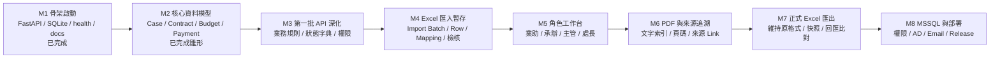
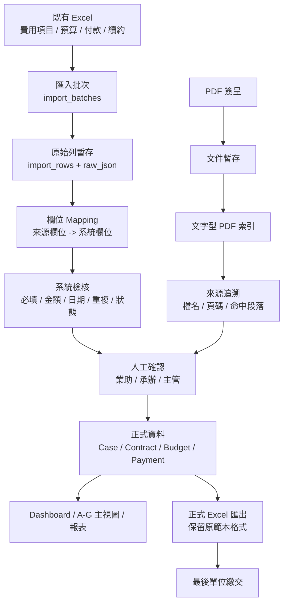
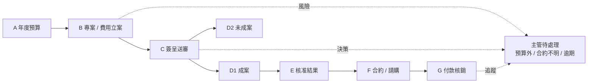
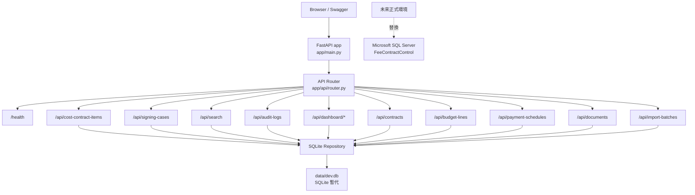
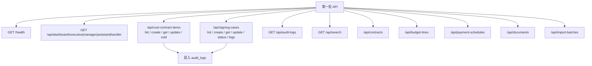

# 費用合約控管系統 - 開發規劃與流程圖

日期：2026-07-03  
目前階段：M2 核心資料模型與 API 雛形已啟動  
開發網址：`http://192.168.1.101:8888`  
目標網址：`http://192.168.1.221:8888`

> 說明：目前這台主機實際 IP 是 `192.168.1.101`。若要使用 `192.168.1.221`，需在該主機部署或調整網卡 IP。

## 1. 開發里程碑



## 2. Excel-first 資料流



## 3. A-G 主管主視圖流程



## 4. 目前 M1 技術架構



## 5. 第一批 API 規劃



## 6. 後續開發順序

1. 補狀態字典：案件、合約、付款、匯入、文件。
2. 補角色權限矩陣：業助、承辦、主管、處長。
3. 擴充 DB schema：Contract、Budget、Payment、Invoice、Document、Import / Export。
4. 建立 Excel 匯入暫存 API。
5. 建立欄位 mapping 與檢核結果 API。
6. 建立正式資料確認流程。
7. 建立業助工作台 UI。
8. 建立主管 A-G 主視圖 API 與 UI。
9. 建立 PDF 文字索引與來源追溯。
10. 建立正式 Excel 原格式匯出。

## 7. 目前已完成驗證

```text
python -m compileall app
pytest -q
GET /health
GET /openapi.json
POST /api/cost-contract-items
GET /api/search
GET /api/audit-logs
```

目前測試結果：

```text
3 passed
```
